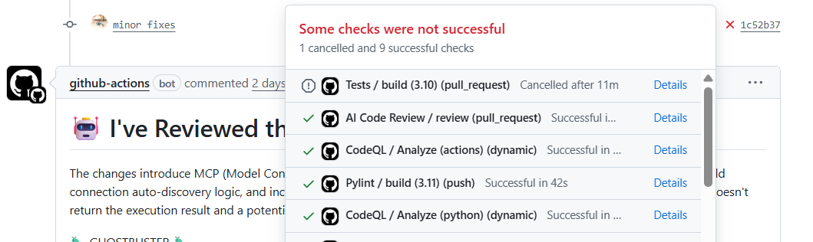

# <a href="https://github.com/Dishank422/CRACK"></a>Troubleshooting

This guide covers common issues you may encounter while using CRACK and provides solutions to resolve them. If your issue is not listed here, please refer to the [Getting Help](#getting-help) section below.

---

## 1. Not seeing a PR comment on GitHub?
  1. On the PR page, click the status icon near the latest commit hash.
  2. Click **Details** to open the Actions run.
  3. Review logs for any errors (e.g., API key missing, token issues).

**Example:**



## 2. LLM API Rate Limit / "Overloaded" Errors

When the LLM provider's rate limits are exceeded, you may encounter errors similar to the following:
```
Error code: 429 - {
    'type': 'error',
    'error': {
        'type': 'rate_limit_error',
        'message': 'This request would exceed the rate limit for your organization...'
    }
}
```

### Automatic Retries

CRACK includes a built-in retry mechanism for handling transient API errors.  
By default, failed requests are retried up to 3 times. This value can be configured in your project settings:

```toml
# .CRACK/config.toml
retries = 4
```

### Concurrency Configuration

If rate limit errors persist, consider reducing the number of concurrent API requests by adjusting the `MAX_CONCURRENT_TASKS` environment variable (default: 40).

**GitHub Workflow** (`.github/workflows/CRACK-code-review.yml`):
```yaml
- name: Run AI code review
  env:
    LLM_API_TYPE: anthropic
    LLM_API_KEY: ${{ secrets.ANTHROPIC_API_KEY }}
    MODEL: claude-opus-4-6
    MAX_CONCURRENT_TASKS: 20
  run: |
    ...
```

**Local Environment** (`~/.CRACK/.env`):
```
LLM_API_TYPE=openai
LLM_API_KEY=sk-...
MODEL=gpt-5.2
MAX_CONCURRENT_TASKS=20
```

For more details, refer to the [microcore configuration reference](https://ai-microcore.github.io/api-reference/microcore/configuration.html#Config.MAX_CONCURRENT_TASKS).


## Getting Help

Couldn't find a solution to your problem? We're here to help!

- **Report a bug or request a feature**: [Open an issue](https://github.com/Dishank422/CRACK/issues/new)
- **Ask a question**: [Start a discussion](https://github.com/Dishank422/CRACK/discussions)
- **Go hands-on**: [Contributing guide](https://github.com/Dishank422/CRACK/blob/main/CONTRIBUTING.md)

  
Your feedback helps improve CRACK for everyone.
